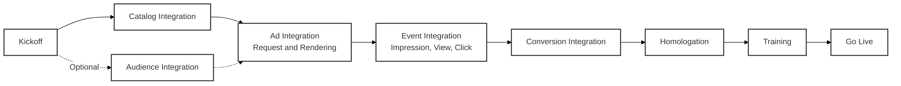

# 5. Ad Integration

This section provides detailed information on how to integrate with the VTEX Ads platform to display ads on your website.

## 5.0 Integration Flow Overview

The complete integration flow is divided into four main phases that continuously feed back into each other:

1. **Preparation and Onboarding:** Align scope and timeline with the VTEX Ads team, receive API credentials, and validate access to environments and webhooks.
2. **Operational Data Synchronization:** Load catalog (products and inventory) and, optionally, audiences. This step ensures that only available products and valid segmentations are eligible to appear.
3. **Ad Delivery:** Structure site placements, configure naming conventions, and query ads in real-time for each context (home, search, category, PDP, etc.), displaying the "Sponsored" label.
4. **Measurement and Optimization:** Fire impression, view, click, and conversion events using `navigator.sendBeacon()`, monitor performance metrics, and adjust bids, segmentation, and positioning according to results.

The following sections detail how to execute each of these phases, with request examples and specific best practices.

- [5.1. API Integration](./5.1-api-integration.md): For a more customized integration, use our REST API to manage the entire ad lifecycle.
- [5.2. VTEX Integration](./5.2-vtex-integration.md): If your store is on the VTEX platform, use our VTEX IO app to simplify the process.
- [5.3. Catalog Synchronization](./5.3-catalog-synchronization.md): Keep your product catalog and inventory synchronized with VTEX Ads.
- [5.4. Audience Integration](./5.4-audience-integration.md): Send audience data to improve targeting and ad relevance.
- [5.5. Ad Query](./5.5-ad-query.md): Request from the API the ads that should be displayed on different pages and contexts.
- [5.5.1. Placement Naming](./5.5.1-placement-naming.md): Recommended standard for naming placements to enable accurate measurement.
- [5.6. Events](./5.6-events.md): Notify the API of user interactions with ads and conversions.
