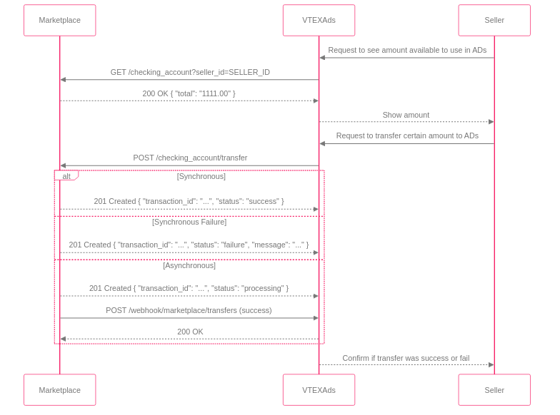

## 7. Credit Transfer

Credit transfer is the flow that allows the marketplace to transfer advertising credits to its sellers. This documentation details the endpoints that the marketplace must implement and the webhook it must consume to integrate with VTEXAds.

<div align="center">
  
</div>

  * **Endpoints to be implemented by the Marketplace (Authentication: Basic Auth):**
    1.  **Check Balance (`GET /checking_account`)**
        *   **Objective:** Check the seller's available balance.
        *   **Query Parameters:** `seller_id`, `publisher_id` (optional, only applies to cases where an entity manages multiple publishers).
        *   **Success Response (200 OK):**
            ```json
            { "total": "1111.00" }
            ```

    2.  **Request Transfer (`POST /checking_account/transfer`)**
        *   **Objective:** Request the transfer of a specific amount.
        *   **Request Body:**
            ```json
            {
              "amount": "10.00",
              "seller_id": "SELLER_ID",
              "publisher_id": "PUBLISHER_ID",
              "transfer_identity_id": "uuid"
            }
            ```
        *   **Responses:**
            - **Synchronous (Success):** `201 Created`
              ```json
              {
                "transaction_id": "TRANSACTION_ID",
                "status": "success"
              }
              ```
            - **Synchronous (Failure):** `400 Bad Request`
              ```json
              {
                "transaction_id": "TRANSACTION_ID",
                "status": "failure",
                "message": "Reason for refusal"
              }
              ```
            - **Asynchronous:** `202 Accepted`
              ```json
              {
                "transaction_id": "TRANSACTION_ID",
                "status": "processing"
              }
              ```

  * **Webhook to be consumed by the Marketplace:**
    *   **Objective:** Notify VTEXAds about the final status of the transfer.
    *   **Endpoint:** `POST https://api-retail-media.newtail.com.br/webhook/marketplace/transfers/:publisher_id`
    *   **Authentication:** `x-api-key` and `x-secret-key`.
    *   **Payload:**
        ```json
        {
          "transaction_id": "TRANSACTION_ID",
          "status": "success"
        }
        ```
        or
        ```json
        {
          "transaction_id": "TRANSACTION_ID",
          "status": "failure",
          "message": "Problem description"
        }
        ```
    *   **Retry Logic:** In case of a webhook call failure, the marketplace must retry.
    *   **Expected Response:** `204 No Content`