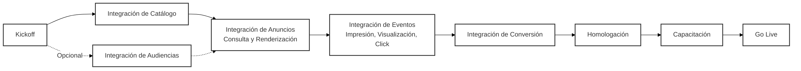

# 5. Integración de Anuncios

Esta sección proporciona información detallada sobre cómo integrarse con la plataforma de VTEX Ads para mostrar anuncios en su sitio web.

## 5.0 Visión General del Flujo de Integración

El flujo de integración completo se divide en cuatro fases principales que se retroalimentan continuamente:

1. **Preparación y Onboarding:** Alinee el alcance y cronograma con el equipo de VTEX Ads, reciba las credenciales de API y valide el acceso a ambientes y webhooks.
2. **Sincronización de Datos Operacionales:** Cargue el catálogo (productos e inventario) y, opcionalmente, audiencias. Este paso garantiza que solo los productos disponibles y segmentaciones válidas estén aptos para aparecer.
3. **Entrega de Anuncios:** Estructure los placements del sitio, configure convenciones de nombre y consulte anuncios en tiempo real para cada contexto (home, búsqueda, categoría, PDP, etc.), mostrando el sello "Patrocinado".
4. **Medición y Optimización:** Dispare los eventos de impresión, visualización, clic y conversión usando `navigator.sendBeacon()`, monitoree las métricas de desempeño y ajuste pujas, segmentaciones y posicionamientos de acuerdo con los resultados.

Las siguientes secciones detallan cómo ejecutar cada una de estas fases, con ejemplos de solicitudes y mejores prácticas específicas.

- [5.1. Integración vía API](./5.1-integracion-via-api.md): Para una integración más personalizada, utilice nuestra API REST para gestionar todo el ciclo de vida de los anuncios.
- [5.2. Integración VTEX](./5.2-integracion-vtex.md): Si su tienda está en la plataforma VTEX, utilice nuestra aplicación VTEX IO para simplificar el proceso.
- [5.3. Sincronización de Catálogo](./5.3-sincronizacion-de-catalogo.md): Mantenga su catálogo de productos e inventario sincronizado con VTEX Ads.
- [5.4. Integración de Audiencias](./5.4-integracion-de-audiencias.md): Envíe datos de audiencia para mejorar la segmentación y la relevancia de los anuncios.
- [5.5. Consulta de Anuncios](./5.5-consulta-de-anuncios.md): Solicite a la API los anuncios que deben ser exhibidos en diferentes páginas y contextos.
- [5.5.1. Recomendación de Nombres de Placements](./5.5.1-recomendacion-de-nombres-de-placements.md): Estándar recomendado de nombres de placements para una medición precisa.
- [5.6. Eventos](./5.6-eventos.md): Notifique a la API sobre todas las interacciones del usuario con los anuncios y las conversiones.
