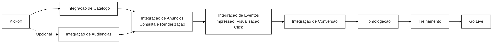

# 5. Integração de Anúncios

Esta seção fornece informações detalhadas sobre como se integrar à plataforma VTEX Ads para exibir anúncios em seu site.

## 5.0 Visão Geral do Fluxo de Integração

O fluxo de integração completo é dividido em quatro fases principais que se retroalimentam continuamente:

1. **Preparação e Onboarding:** Alinhe escopo e cronograma com a equipe da VTEX Ads, receba as credenciais de API e valide acesso a ambientes e webhooks.
2. **Sincronização de Dados Operacionais:** Carregue catálogo (produtos e inventário) e, opcionalmente, audiências. Essa etapa garante que apenas produtos disponíveis e segmentações válidas estejam aptos a aparecer.
3. **Entrega de Anúncios:** Estruture os placements do site, configure convenções de nome e consulte anúncios em tempo real para cada contexto (home, busca, categoria, PDP etc.), exibindo o selo “Patrocinado”.
4. **Mensuração e Otimização:** Dispare os eventos de impressão, visualização, clique e conversão usando `navigator.sendBeacon()`, monitore as métricas de desempenho e ajuste lances, segmentações e posicionamentos de acordo com os resultados.

As seções seguintes detalham como executar cada uma dessas fases, com exemplos de requisições e boas práticas específicas.

- [5.1. Integração via API](./5.1-integracao-via-api.md): Para uma integração mais personalizada, use nossa API REST para gerenciar todo o ciclo de vida do anúncio.
- [5.2. Integração VTEX](./5.2-integracao-vtex.md): Se sua loja estiver na plataforma VTEX, use nosso aplicativo VTEX IO para simplificar o processo.
- [5.3. Sincronização de Catálogo](./5.3-sincronizacao-de-catalogo.md): Mantenha seu catálogo de produtos e inventário sincronizados com a VTEX Ads.
- [5.4. Integração de Audiências](5.4-integracao-de-audiencias.md): Envie dados de audiência para melhorar a segmentação e a relevância dos anúncios.
- [5.5. Consulta de Anúncios](5.5-consulta-de-anuncios.md): Requisite à API os anúncios que devem ser exibidos em diferentes páginas e contextos.
- [5.5.1. Recomendação de Nomes de Placements](5.5.1-recomendacao-de-nomes-de-placements.md): Padrão recomendado de nomenclatura de placements para medições precisas.
- [5.6. Eventos](5.6-eventos.md): Notifique a API sobre as interações dos usuários com os anúncios e as conversões.
