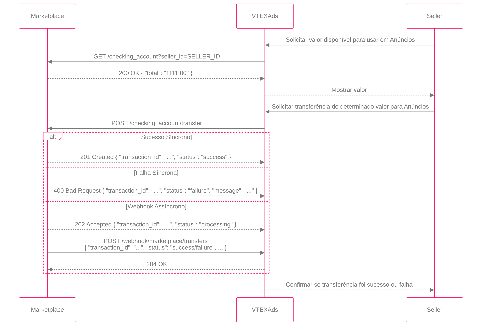

## 7. Repasse de Créditos

O repasse de créditos é o fluxo que permite ao marketplace transferir créditos de anúncio para seus sellers. Esta documentação detalha os endpoints que o marketplace deve implementar e o webhook que deve consumir para realizar a integração com a VTEXAds.

<div align="center">
  
</div>

  * **Endpoints a serem implementados pelo Marketplace (Autenticação: Basic Auth):**
    1.  **Consulta de Saldo (`GET /checking_account`)**
        *   **Objetivo:** Verificar o saldo disponível do seller.
        *   **Parâmetros (Query):** `seller_id`, `publisher_id` (opcional, utilizado apenas em casos onde uma entidade gerencia múltiplos publishers).
        *   **Resposta de Sucesso (200 OK):**
            ```json
            { "total": "1111.00" }
            ```

    2.  **Solicitação de Transferência (`POST /checking_account/transfer`)**
        *   **Objetivo:** Requisitar a transferência de um valor.
        *   **Corpo da Requisição:**
            ```json
            {
              "amount": "10.00",
              "seller_id": "SELLER_ID",
              "publisher_id": "PUBLISHER_ID",
              "transfer_identity_id": "uuid"
            }
            ```
        *   **Respostas:**
            - **Síncrona (Sucesso):** `201 Created`
              ```json
              {
                "transaction_id": "TRANSACTION_ID",
                "status": "success"
              }
              ```
            - **Síncrona (Falha):** `400 Bad Request`
              ```json
              {
                "transaction_id": "TRANSACTION_ID",
                "status": "failure",
                "message": "Motivo da recusa"
              }
              ```
            - **Assíncrona:** `202 Accepted`
              ```json
              {
                "transaction_id": "TRANSACTION_ID",
                "status": "processing"
              }
              ```

  * **Webhook a ser consumido pelo Marketplace:**
    *   **Objetivo:** Notificar a VTEXAds sobre o status final da transferência.
    *   **Endpoint:** `POST https://api-retail-media.newtail.com.br/webhook/marketplace/transfers/:publisher_id`
    *   **Autenticação:** `x-api-key` e `x-secret-key`.
    *   **Payload:**
        ```json
        {
          "transaction_id": "TRANSACTION_ID",
          "status": "success"
        }
        ```
        ou
        ```json
        {
          "transaction_id": "TRANSACTION_ID",
          "status": "failure",
          "message": "Descrição do problema"
        }
        ```
    *   **Lógica de Retry:** Em caso de falha na chamada do webhook, o marketplace deve realizar novas tentativas.
    *   **Resposta Esperada:** `204 No Content`